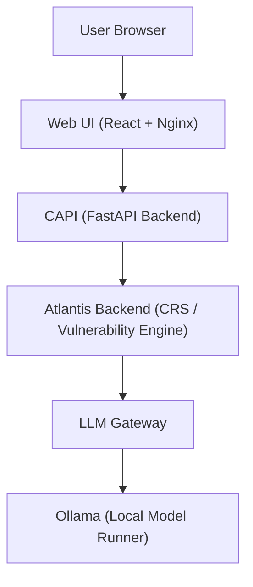

# Atlantis Architecture

This document explains how the pieces in this fork fit together, both for the simple CRS stack and the Phase 2 competition stack.

### 1. High-Level Overview

There are two main ways to use this repo:

1. Core CRS + Scripts (Simple Stack  
   Use docker-compose.yml in the repo root to start:
   - atlantis-webservice (CRS backend)
   - ollama (LLM host)  
   Then run the helper shell scripts to scan individual files or repos.

2. Phase 2 CAPI + Web UI Stack  
   Use Phase_2/stack/compose.yaml to start:
   - Atlantis backend
   - CAPI (Competition API)
   - LLM gateway
   - Ollama  
   Optionally build and run the Web UI (Phase_2/webui) for a portal-style experience.

### 2. Core CRS Stack

#### 2.1 Components

Services (root docker-compose.yml:

- Atlantis Webservice
  - Implements the CRS API.
  - Accepts file/repo scan requests via HTTP.
  - Manages chunking, prompt construction, and aggregation of LLM responses.
  - Exposes health and status endpoints.

- Ollama
  - Hosts the actual LLM.
  - Provides a local HTTP API for completions.
  - Keeps all model traffic on your machine.

Client-side pieces:

- Shell scripts (root + scripts/)
  - Wrap calls to the CRS webservice.
  - Take:
    - a path to a file / repo
    - a short natural-language query / focus 
  - Stream / chunk source code, send requests, and write JSON output to disk.

- Example Java files
  - VulnerableApp.java and UserImpersonation.java are small, known-bad examples.

##### 2.2 Data Flow (Simple Stack)

'''text
## 4.2 Data Flow – Phase 2 (With Web UI)

